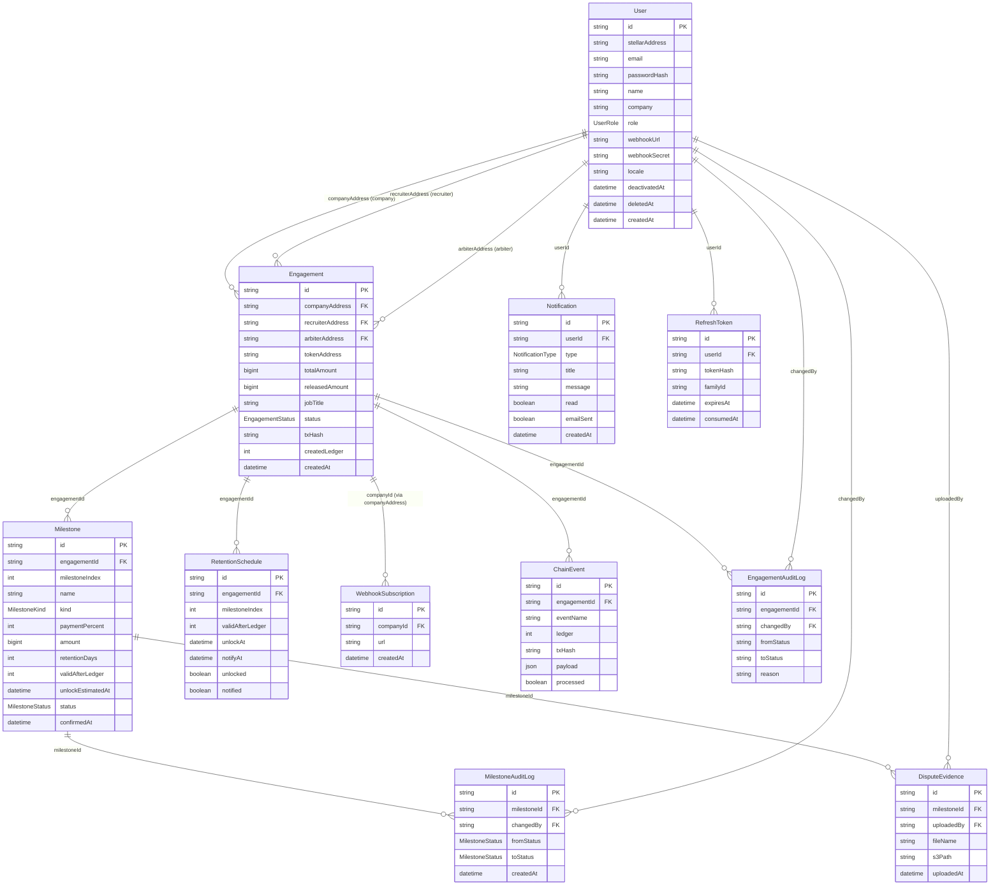

# Database Schema

This document describes the purpose of each database model in HireSettle, its primary fields, and how it relates to other models.

---

# Entity Relationships

---

# User

## Purpose

Represents every authenticated platform user, including companies, recruiters, arbiters, and administrators.

## Key Fields

| Field | Description |
|------|-------------|
| id | Primary identifier |
| stellarAddress | Wallet address used on-chain |
| email | User email |
| role | User role (Company, Recruiter, Arbiter, Admin) |
| company | Company name (for company users) |
| webhookUrl | Optional webhook endpoint |
| avatarUrl | User avatar |
| locale | BCP-47 tag for localized email templates (default `en`) |
| deactivatedAt | Soft delete timestamp |

## Relationships

- One user can own many company engagements.
- One user can own many recruiter engagements.
- One user can own many arbiter engagements.
- One user can have many refresh tokens.
- One user can receive many notifications.
- One user can configure notification preferences.
- One user can create milestone audit logs.
- One user can upload dispute evidence.
- One user can generate engagement audit logs.
- One user can generate security events.

---

# RefreshToken

## Purpose

Stores refresh tokens used for JWT authentication and token rotation.

## Key Fields

- tokenHash
- familyId
- expiresAt
- consumedAt
- revokedAt

## Relationships

- Belongs to one User.

---

# Engagement

## Purpose

Represents an escrow agreement between a company and recruiter. This is the central entity of the application and mirrors the on-chain engagement.

## Key Fields

| Field | Description |
|------|-------------|
| id | On-chain engagement identifier |
| companyAddress | Company wallet |
| recruiterAddress | Recruiter wallet |
| arbiterAddress | Arbiter wallet |
| tokenAddress | Payment token |
| totalAmount | Total escrow amount |
| releasedAmount | Amount already released |
| jobTitle | Job title |
| jobDescription | Off-chain metadata |
| salaryRange | Off-chain metadata |
| location | Off-chain metadata |
| status | Current engagement status |
| txHash | Blockchain transaction |
| createdLedger | Ledger where engagement was created |

## Relationships

- Belongs to one Company user.
- Belongs to one Recruiter user.
- Belongs to one Arbiter user.
- Has many milestones.
- Has many blockchain events.
- Has many engagement audit logs.

---

# Milestone

## Purpose

Represents a payment milestone within an engagement.

Milestones can be placement or retention based.

## Key Fields

- milestoneIndex
- name
- kind
- paymentPercent
- amount
- retentionDays
- validAfterLedger
- unlockEstimatedAt
- status
- proofHash
- disputeReason
- paymentReleased
- confirmedAt

## Relationships

- Belongs to one Engagement.
- Has many milestone audit logs.
- Has many dispute evidence records.

---

# MilestoneAuditLog

## Purpose

Maintains a history of milestone status changes.

## Key Fields

- fromStatus
- toStatus
- changedBy
- createdAt

## Relationships

- Belongs to one Milestone.
- References the User who made the change.

---

# EngagementAuditLog

## Purpose

Stores lifecycle changes made to an engagement.

## Key Fields

- fromStatus
- toStatus
- changedBy
- reason

## Relationships

- Belongs to one Engagement.
- References the User who performed the action.

---

# DisputeEvidence

## Purpose

Stores files uploaded as evidence during milestone disputes.

## Key Fields

- fileName
- fileSize
- mimeType
- s3Path
- s3Url
- uploadedAt

## Relationships

- Belongs to one Milestone.
- Uploaded by one User.

---

# ChainEvent

## Purpose

Stores blockchain events retrieved from the Stellar network before they are processed.

## Key Fields

- eventName
- ledger
- txHash
- payload
- processed
- retryCount
- lastErrorAt

## Relationships

- Optionally belongs to one Engagement.

---

# DeadLetterEvent

## Purpose

Stores blockchain events that repeatedly fail processing.

## Key Fields

- originalId
- eventName
- ledger
- txHash
- payload
- retryCount
- errorMessage

## Relationships

- References an engagement through engagementId.

---

# Notification

## Purpose

Represents in-app notifications delivered to users.

## Key Fields

- type
- title
- message
- data
- read
- emailSent

## Relationships

- Belongs to one User.

---

# NotificationPreference

## Purpose

Stores each user's notification delivery preferences.

## Key Fields

- type
- emailEnabled

## Relationships

- Belongs to one User.
- One preference exists per notification type.

---

# EngagementTemplate

## Purpose

Stores reusable engagement templates created by companies.

## Key Fields

- name
- jobTitle
- jobDescription
- salaryRange
- location
- milestoneConfig

## Relationships

- Belongs to one Company (User).

---

# RetentionSchedule

## Purpose

Tracks retention milestones that unlock in the future.

The scheduler uses this table to determine when notifications should be sent and when milestones become eligible for confirmation.

## Key Fields

- engagementId
- milestoneIndex
- validAfterLedger
- unlockAt
- notifyAt
- unlocked
- notified

## Relationships

- References an engagement milestone using the engagement ID and milestone index.

---

# SecurityEvent

## Purpose

Stores security-related events for auditing and incident response.

## Key Fields

- action
- ip
- userAgent
- createdAt

## Relationships

- Optionally belongs to one User.

---

# AuditLog

## Purpose

Stores administrative changes performed on application entities.

## Key Fields

- entityType
- entityId
- action
- oldValue
- newValue
- reason
- changedBy

## Relationships

This model records entity changes by identifier and does not define explicit Prisma relations.

---

# SystemConfig

## Purpose

Stores application-wide configuration values.

## Key Fields

- key
- value
- updatedAt

## Relationships

This model is independent and does not reference other models.