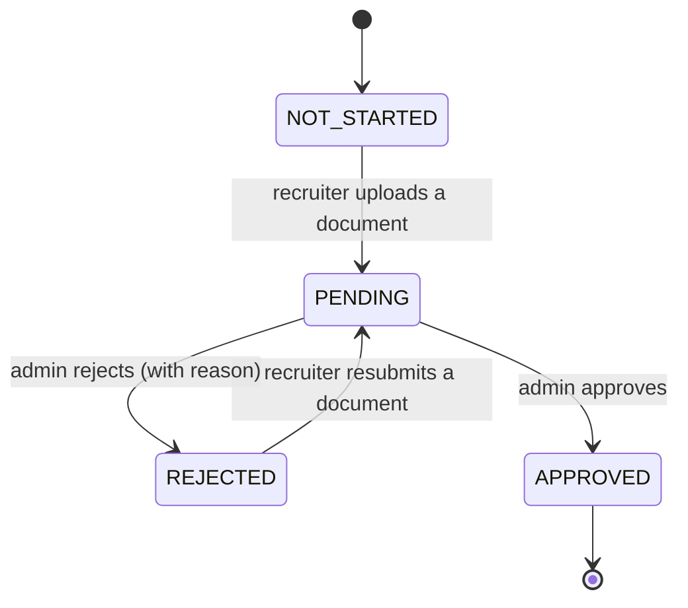

# Recruiter KYC Workflow

This document describes the Know Your Customer (KYC) verification workflow for
recruiter accounts. KYC is implemented in
`src/modules/recruiters/kyc.service.ts` and driven by the `KycStatus` enum.

KYC is only available for users with the `RECRUITER` role. Any other role
receiving a KYC request is rejected with `403 Forbidden`.

## KYC States

`KycStatus` has the following values:

| Status        | Meaning                                                                 |
| ------------- | ----------------------------------------------------------------------- |
| `NOT_STARTED` | No documents have been submitted yet (initial state).                   |
| `PENDING`     | At least one document has been uploaded and is awaiting admin review.   |
| `APPROVED`    | An admin approved the recruiter's documents.                            |
| `REJECTED`    | An admin rejected the submission; a rejection reason is recorded.       |

## State Transitions



Notes on transitions:

- Uploading a document moves the recruiter to `PENDING` and clears any prior
  `kycRejectionReason`, `kycReviewedAt`, and `kycReviewedBy`.
- A recruiter whose status is `APPROVED` cannot upload further documents
  (`400 Bad Request`).
- Admin review is only allowed while the status is `PENDING`; reviewing a
  non-pending account returns `400 Bad Request`.
- A rejected recruiter may resubmit documents, which returns them to `PENDING`
  for another review cycle.

## Recruiter Endpoints

All endpoints require authentication as a recruiter.

### `GET /recruiters/me/kyc`

Returns the current KYC status and the recruiter's uploaded documents.

**Auth:** Bearer token for a `RECRUITER` account.

**Response `200 OK`:**

```json
{
  "id": "usr_123",
  "role": "RECRUITER",
  "kycStatus": "PENDING",
  "kycReviewedAt": null,
  "kycReviewedBy": null,
  "kycRejectionReason": null,
  "kycDocuments": [
    {
      "id": "doc_456",
      "fileName": "passport.pdf",
      "fileSize": 204800,
      "mimeType": "application/pdf",
      "s3Path": "kyc/usr_123/1700000000000-passport.pdf",
      "uploadedAt": "2024-01-01T12:00:00.000Z"
    }
  ]
}
```

Documents are ordered by `uploadedAt` descending (most recent first).

**Errors:**

- `403 Forbidden` — the authenticated user is not a recruiter.
- `404 Not Found` — the user does not exist.

### `POST /recruiters/me/kyc/documents`

Uploads a KYC document for review. The upload is stored in S3 and the
recruiter's status is set to `PENDING`.

**Auth:** Bearer token for a `RECRUITER` account.

**Request:** `multipart/form-data` with a single `file` field.

**Response `201 Created`:**

```json
{
  "id": "doc_456",
  "userId": "usr_123",
  "fileName": "passport.pdf",
  "fileSize": 204800,
  "mimeType": "application/pdf",
  "s3Path": "kyc/usr_123/1700000000000-passport.pdf",
  "s3Url": "https://...",
  "uploadedAt": "2024-01-01T12:00:00.000Z"
}
```

**Errors:**

- `400 Bad Request` — invalid file type, file too large, or KYC already
  approved.
- `403 Forbidden` — the authenticated user is not a recruiter.
- `404 Not Found` — the user does not exist.

## Accepted File Types and Size Limits

| Constraint | Value                                                              |
| ---------- | ------------------------------------------------------------------ |
| MIME types | `image/jpeg`, `image/png`, `image/gif`, `application/pdf`          |
| Max size   | 10 MB (`10 * 1024 * 1024` bytes)                                   |

Uploads that do not match an allowed MIME type or exceed the size limit are
rejected with `400 Bad Request`.

## Admin Review

Admins review pending recruiters through the admin KYC endpoints:

- `GET /admin/kyc/pending` — list recruiters with `PENDING` status (paginated).
- `POST /admin/kyc/:userId/approve` — approve a pending recruiter.
- `POST /admin/kyc/:userId/reject` — reject a pending recruiter with an
  optional reason.

Review requires the recruiter to be in `PENDING` status and to have at least
one uploaded document. On approval the status becomes `APPROVED`; on rejection
it becomes `REJECTED` and the supplied reason is stored in
`kycRejectionReason`. Both actions record `kycReviewedAt` and `kycReviewedBy`.
